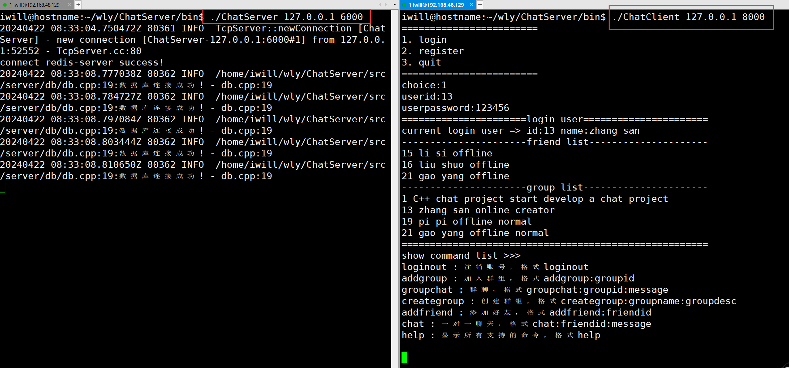

# ChatServer
基于 C++ 实现的集群聊天服务器和客户端（muduo、pthread、mysql、json、nginx、keepalived、redis）
集群框架：采用如下图Nginx + Keepalived主从模式的高可用集群方案

业务框架：


# 1. 环境配置（ubuntu）

## 1.1 安装cmake、g++等编译环境

```bash
# 安装cmake、g++等编译环境
sudo apt-get install cmake	
sudo apt-get install g++
sudo apt-get install gcc
```

## 1.2 安装muduo库

```bash
# muduo依赖于Boost，所以需要安装Boost（一个准标准库）
sudo apt-get install libboost-dev libboost-test-dev		

# 编译安装muduo（基于Reactor模式的网络库）
git clone https://github.com/chenshuo/muduo.git
cd muduo
./build.sh -j2									# 编译muduo库和它自带的例子（生成的编译文件位于muduo同级目录）
./build.sh install  							# 将muduo头文件和库文件安装到build/release-install-cpp11/lib
sudo mv ../build/release-install-cpp11/include/muduo/ /usr/include/		# 将inlcude（头文件）拷贝到系统目录
sudo mv ../build/release-install-cpp11/lib/* /usr/local/lib/			# 将lib（库文件）拷贝到系统目录
cd ..
sudo rm build/ muduo/ -r
```

## 1.3 安装mysql

```bash
# 重新安装mysql（以8.0为例）
sudo service mysql stop
sudo apt-get update
sudo apt purge mysql-*
sudo rm -rf /etc/mysql/ /var/lib/mysql
sudo apt autoremove								# 删除已经安装的软件包（其他软件的依赖，而此依赖关系已经不存在）
sudo apt clean
sudo apt install mysql-server
sudo apt install mysql-client
sudo apt install libmysqlclient-dev
# sudo apt-get install libssl1.1=1.1.1-1ubuntu2.1~18.04.23	# 若遇到依赖版本问题，可以指定libmysqlclient-dev依赖版本
# sudo apt-get install zlib1g=1:1.2.11.dfsg-0ubuntu2.2
sudo vim /etc/mysql/mysql.conf.d/mysqld.cnf     # 注意：将bind-address = 127.0.0.1  改成 bind-address = 0.0.0.0
sudo mysql -uroot -proot
mysql>ALTER USER 'root'@'localhost' IDENTIFIED WITH mysql_native_password BY '123456';		# 重置root用户的密码
mysql>CREATE USER 'wly'@'%' IDENTIFIED BY '123456'; 					# 创建允许从任何主机访问的用户wly
mysql>GRANT ALL PRIVILEGES ON *.* TO 'wly'@'%' WITH GRANT OPTION;		# 给远程访问的wly用户授予所有权限
msyql>CREATE DATABASE IF NOT EXISTS chat;								# 创建空数据库
mysql>exit

sudo mysql -u root -p chat < chat_backup.sql							# 创建数据库

vim include/public.hpp      # 修改数据库配置文件路径
'#define DB_CNF_PATH "/home/iwill/wly/ChatServer/include/server/db_connection_pool/db.cnf"'

# sudo service mysql stop		# 关闭数据库
# sudo service mysql status		# 数据库状态
```

## 1.4 安装redis

```bash
sudo apt-get install redis-server           # 安装redis（安装完成后，自动启动）
netstat -anp | grep redis                   # 查看redis进程

sudo git clone https://github.com/redis/hiredis     # 下载hiredis（C++语言写的redis客户端库）
cd hiredis
sudo make                                           # 编译hiredis
sudo make install                                   # 安装hiredis
cd .. && sudo rm hiredis -r
sudo ldconfig /usr/local/lib                        # 刷新动态链接库
```

## 1.5 安装nginx

```bash
sudo apt install nginx              # 默认配置文件目录/etc/nginx。/etc通常用于存放linux系统的配置文件。
sudo vim /etc/nginx/nginx.conf      # 添加tcp长连接负载均衡配置（拷贝下述文本至文件中。与http负载均衡配置同级）
#########################################################################
# nginx tcp loadbalance config
stream{
    upstream MyServer{
    server 192.168.48.129:6000 weight=1 max_fails=3 fail_timeout=30s;    # chatServer1 运行在server1的6000端口
    server 192.168.48.132:6000 weight=1 max_fails=3 fail_timeout=30s;    # chatServer2 运行在server2的6000端口
    }

    server{
        proxy_connect_timeout 1s;   
        #proxy_timeout 3s;
        listen 8000;                # nginx 监听的端口
        proxy_pass MyServer;        # 向MyServer负载均衡模块进行负载均衡
        tcp_nodelay on;
    }
}
#########################################################################
sudo nginx -s reload                        # 平滑加载nginx配置文件
sudo netstat -anp | grep 8000               # 查看监听8000端口的进程
sudo nginx -s stop                          # 停止nginx服务
```


# 2. 编译该项目

```bash
cd ChatServer
sh auto_build.sh
```


# 3. 测试

```bash
# 注意负载均衡器是工作在8000端口的，所以要使用8000端口进行测试
./bin/ChatServer 127.0.0.1 6000		# 服务端1
./bin/ChatServer 127.0.0.1 6001		# 服务端2
./bin/ChatClient 127.0.0.1 8000		# 客户端1
./bin/ChatClient 127.0.0.1 8000		# 客户端2
```




# 4. Jmeter压测
    不使用集群：
        ulimit -n 1024            
            并发连接数：100    TPS：1241.1/sec
            并发连接数：200    TPS：1922.7/sec
            并发连接数：400    TPS：2383.5/sec
            并发连接数：500    TPS：2890.1/sec
        ulimit -n 2048
            并发连接数：600    TPS：2806.3/sec
            并发连接数：1000   TPS：2798.1/sec


    使用集群：
        ulimit -n 1024
            待测试...

    sudo netstat -anp | grep 8000 | wc -l   # 查看8000端口监听的进程数量


