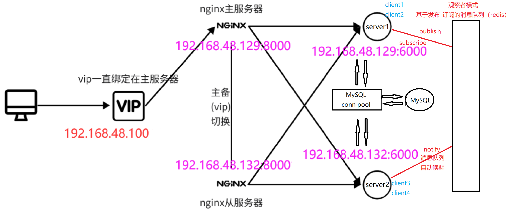
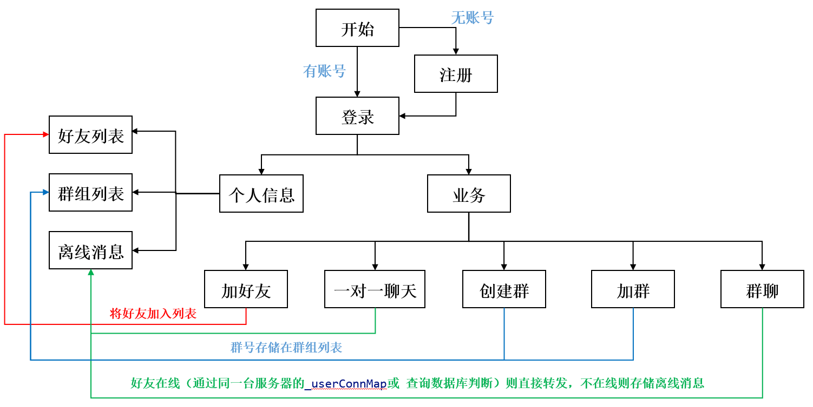
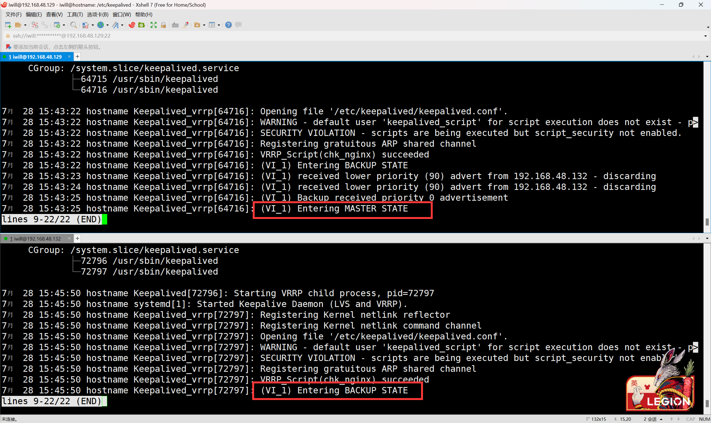
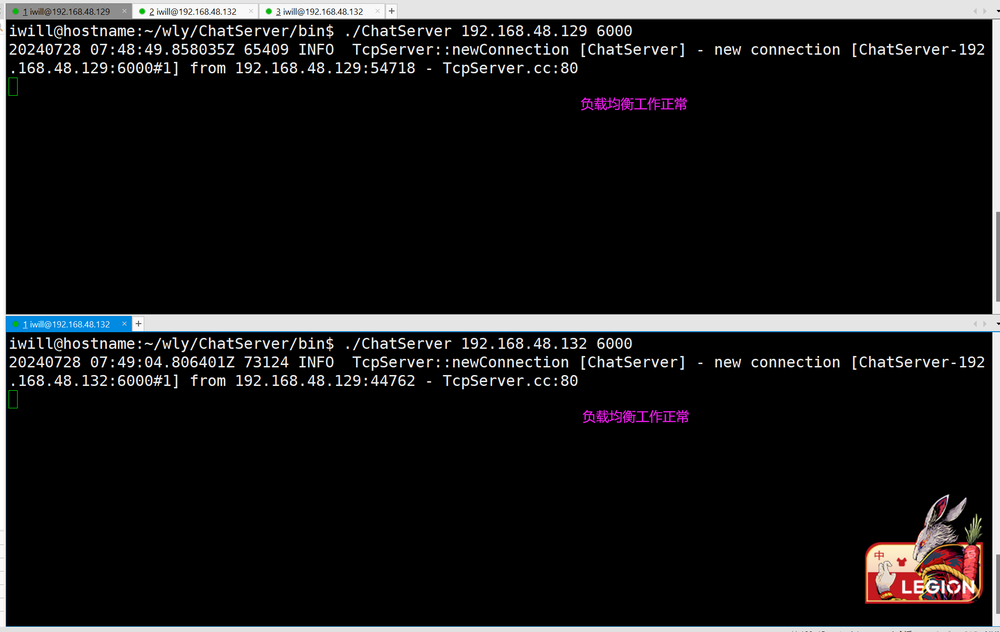
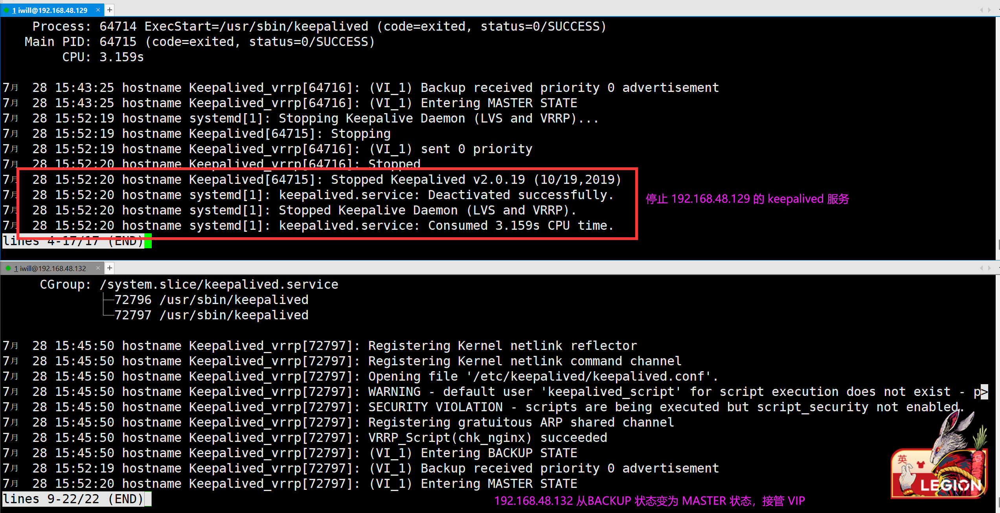
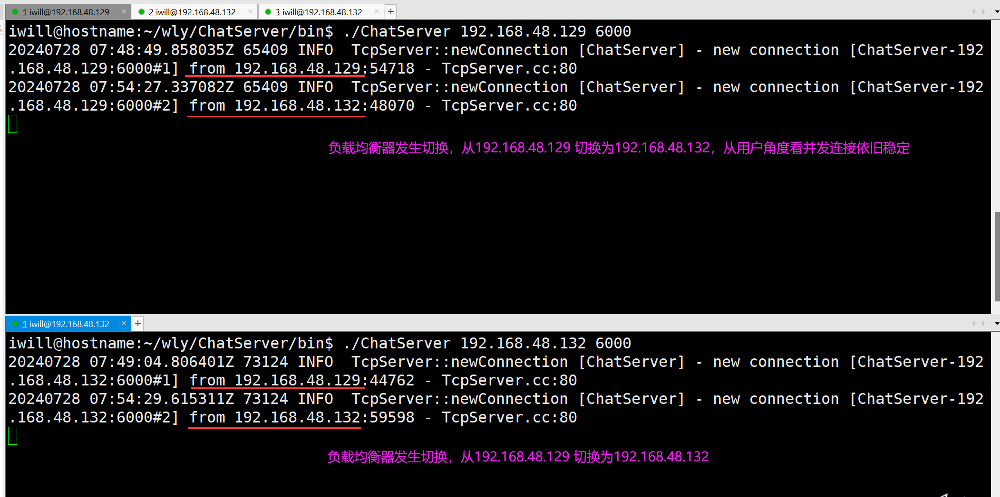

<!-- # ChatServer
基于 C++ 实现的集群聊天服务器和客户端（muduo、pthread、mysql、json、nginx、keepalived、redis） -->


# 0. ChatServer

**项目名称**：基于 C++ 实现的集群聊天服务器和客户端

**技术栈**：muduo、mysql、json、nginx、keepalived、redis

**项目内容**：
- **业务架构设计**： 设计并实现了用户注册、 安全登录、 好友关系管理、一对一聊天及群组聊天等核心社交功能；
- **网络模块构建**： 采用Muduo 网络库（基于 Reactor 模型）作为网络核心，构建高并发网络 IO 服务器，实现网络和业务模块代码解耦， 极大提升了系统可维护性、扩展性；
- **通信协议开发**： 设计并实现了**基于 Json 的自定义通信协议**，确保了客户端与服务器间高效、安全的数据交换；
- **消息队列设计**： 基于 Redis 的发布-订阅功能设计**异步消息队列**， 有效支持了客户端跨服务器的实时通信需求；
- **<u>负载均衡策略实施</u>**： 利用 **Nginx+Keepalived 主从模式集群方案**， 解决 **Nginx 单节点故障问题**， 保证并发稳定性；
- **<u>数据库性能优化</u>**： 使用**自实现的 MySQL 数据库连接池**优化数据存取性能（单线程 QPS 从 84.2 优化至 2212.3）；
- **<u>系统性能测试与调优</u>**： 本地使用 Jmeter 进行压测，通过调整系统资源上限（如 fd），进一步强化了系统并发能力；

**项目收获**： 熟悉了基于开源网络库进行服务端程序设计、 nginx 负载均衡配置、数据持久化存储和服务端中间件的应用。
- - - - - - - - - - - - -
**集群架构**：采用如下图 Nginx + Keepalived 主从模式的高可用集群方案


**架构规划**：使用两台虚拟机模拟（server1: 192.168.48.129、server2: 192.168.48.132）

| 角色           | vip地址(Keepalived) | ip地址(Nginx)       | 软件               | OS             |
| -------------- | ------------------- | ------------------- | ------------------ | -------------- |
| nginx 主服务器 | 192.168.48.100:8000 | 192.168.48.129:8000 | nginx + keepalived | ubuntu 20.04   |
| nginx 从服务器 | 192.168.48.100:8000 | 192.168.48.132:8000 | nginx + keepalived | ubuntu 20.04_2 |


**业务架构**：采用如下图的业务架构


- - - - - - - - - - - - -

# 1. 环境配置（ubuntu）

## 1.1 安装 Cmake、G++等编译环境

```bash
# 安装cmake、g++等编译环境
sudo apt-get install cmake	
sudo apt-get install g++
sudo apt-get install gcc
```

## 1.2 安装 Muduo库

```bash
# muduo依赖于Boost，所以需要安装Boost（一个准标准库）
sudo apt-get install libboost-dev libboost-test-dev		

# 编译安装muduo（基于Reactor模式的网络库）
git clone https://github.com/chenshuo/muduo.git
cd muduo
./build.sh -j2									# 编译muduo库和它自带的例子（生成的编译文件位于muduo同级目录）
./build.sh install  							# 将muduo头文件和库文件安装到build/release-install-cpp11/lib
sudo mv ../build/release-install-cpp11/include/muduo/ /usr/include/		# 将inlcude（头文件）拷贝到系统目录
sudo mv ../build/release-install-cpp11/lib/* /usr/local/lib/			# 将lib（库文件）拷贝到系统目录
cd ..
sudo rm build/ muduo/ -r
```

## 1.3 安装 MySQL

```bash
# 重新安装mysql（以8.0为例）
sudo service mysql stop
sudo apt-get update
sudo apt purge mysql-*
sudo rm -rf /etc/mysql/ /var/lib/mysql
sudo apt autoremove								# 删除已经安装的软件包（其他软件的依赖，而此依赖关系已经不存在）
sudo apt clean
sudo apt install mysql-server
sudo apt install mysql-client
sudo apt install libmysqlclient-dev
# sudo apt-get install libssl1.1=1.1.1-1ubuntu2.1~18.04.23	# 若遇到依赖版本问题，可以指定libmysqlclient-dev依赖版本
# sudo apt-get install zlib1g=1:1.2.11.dfsg-0ubuntu2.2
sudo vim /etc/mysql/mysql.conf.d/mysqld.cnf     # 注意：将bind-address = 127.0.0.1  改成 bind-address = 0.0.0.0
sudo mysql -uroot -proot
mysql>ALTER USER 'root'@'localhost' IDENTIFIED WITH mysql_native_password BY '123456';		# 重置root用户的密码
mysql>CREATE USER 'wly'@'%' IDENTIFIED BY '123456'; 					# 创建允许从任何主机访问的用户wly
mysql>GRANT ALL PRIVILEGES ON *.* TO 'wly'@'%' WITH GRANT OPTION;		# 给远程访问的wly用户授予所有权限
msyql>CREATE DATABASE IF NOT EXISTS chat;								# 创建空数据库
mysql>exit

sudo mysql -u root -p chat < chat_backup.sql							# 创建数据库

vim include/public.hpp      # 修改数据库配置文件路径
'#define DB_CNF_PATH "/home/iwill/wly/ChatServer/include/server/db_connection_pool/db.cnf"'

# sudo service mysql stop		# 关闭数据库
# sudo service mysql status		# 数据库状态
```

## 1.4 安装 Redis

```bash
sudo apt-get install redis-server           # 安装redis（安装完成后，自动启动）
netstat -anp | grep redis                   # 查看redis进程

sudo git clone https://github.com/redis/hiredis     # 下载hiredis客户端库（C++语言写的redis客户端库）
cd hiredis
sudo make                                           # 编译hiredis
sudo make install                                   # 安装hiredis
cd .. && sudo rm hiredis -r
sudo ldconfig /usr/local/lib                        # 刷新动态链接库
```

## 1.5 安装配置 Nginx

1. 执行下述命令安装 Nginx
```bash
$ sudo apt install nginx               # 默认配置文件目录/etc/nginx。/etc通常用于存放linux系统的配置文件。
```

2. 在server1、server2 的 Nginx 的配置文件中均添加 tcp 长连接负载均衡配置
```bash
$ sudo vim /etc/nginx/nginx.conf       # 添加tcp长连接负载均衡配置（拷贝下述文本至文件中。与http负载均衡配置同级）

##################################################
#                   ->  192.168.48.129:6000
#   127.0.0.1:8000  
#                   ->  192.168.48.132:6000
##################################################
# nginx tcp loadbalance config
stream{
    upstream MyServer{
        server 192.168.48.129:6000 weight=1 max_fails=3 fail_timeout=30s;    # chatServer1 运行在server1的6000端口
        server 192.168.48.132:6000 weight=1 max_fails=3 fail_timeout=30s;    # chatServer2 运行在server2的6001端口
    }

    server{
        proxy_connect_timeout 1s;   
        #proxy_timeout 3s;
        listen 8000;                # Nginx 监听的端口 8000
        proxy_pass MyServer;        # 向 MyServer负载均衡模块进行负载均衡
        tcp_nodelay on;
    }
}
##################################################
# $ sudo nginx -c /etc/nginx/nginx.conf
$ sudo nginx -s reload                      # 平滑加载nginx配置文件
$ sudo nginx -s stop                        # 停止nginx服务
$ sudo netstat -anp | grep 8000             # 查看监听8000端口的进程
```


## 1.6 安装配置 Keepalived
1. 执行下述命令安装 Keepalived
```bash
$ sudo apt-get install keepalived			   # 安装keepalived 
```
2. 分别配置server1、server2 的 Keepalived 的配置文件。

```bash
$ sudo vim /etc/keepalived/keepalived.conf	   # keepalived的配置 

##################################################
# chk_nginx 脚本检测到Nginx服务不可用，Keepalived将根据脚本的返回值来决定是否降低当前MASTER节点的优先级。如果优先级降低到不足以保持 MASTER 状态，VRRP将进行故障转移，另一个配置为 BACKUP 的节点将接管虚拟IP地址，并继续提供服务
global_defs {
   router_id 192.168.48.130     # 用于标识 VRRP 实例
}
vrrp_script chk_nginx {
    script "/etc/keepalived/nginx_chk.sh"  # 用于检查nginx运行状态
    interval 2  
}
vrrp_instance VI_1{
    state MASTER                # 初始化为主节点
    interface ens33
    virtual_router_id 100       # 通常用来帮助 VRRP 实例识别自己和其他 VRRP 实例
    priority 101                # 主节点优先级（从服务器可设置较低优先级）
    advert_int 1                # VRRP 广播消息间隔，单位是s
    authentication {
        auth_type PASS
        auth_pass 1111
    }
    virtual_ipaddress {
        192.168.48.100	        # 定义了虚拟 IP 地址 (VIP)，客户端用来访问服务的虚拟 IP 地址
    }
    track_script {              # 跟踪脚本 chk_nginx，如果脚本检测到 Nginx服务不可用，可能导致VRRP状态改变
        chk_nginx
        decrement 10            # 如果脚本失败，则减少 10 的优先级
    }
}
##################################################
```

3. 编写跟踪脚本
```bash
$ sudo vim /etc/keepalived/nginx_chk.sh

##################################################
#!/bin/bash
#上面这句注释不可删除
#检查是否有nginx相关的进程
A=`ps -C nginx --no-header |wc -l`
#如果没有  
if [ $A -eq 0 ];then
	# 重启nginx，延迟2秒 
    service nginx restart
    sleep 2  
    # 重新检查是否有nginx相关的进程
    if [ `ps -C nginx --no-header |wc -l` -eq 0 ];then  
    	# 仍然没有nginx相关的进程,杀死当前keepalived，切换到备用机
        killall keepalived  
    fi  
fi 
#########################################################################
$ sudo chmod +x /etc/keepalived/nginx_chk.sh
$ sudo systemctl start keepalived
$ sudo systemctl stop keepalived
$ sudo systemctl status keepalived.service
```

# 2. 编译该项目

```bash
cd ChatServer
sh auto_build.sh
```


# 3. Nginx+Keepalived 主从模式测试
1.启动服务集群
```bash
# 192.168.48.129
$ ./bin/ChatServer 192.168.48.129 6000	# 启动服务端1
$ sudo nginx -s reload                  # 检查nginx  
$ sudo netstat -anp | grep 8000         
$ sudo systemctl start keepalived       # 检查keepalived
$ sudo systemctl status keepalived

# 192.168.48.132
./bin/ChatServer 192.168.48.132 6000	# 服务端2
$ sudo nginx -s reload                  # 检查nginx  
$ sudo netstat -anp | grep 8000         
$ sudo systemctl start keepalived       # 检查keepalived
$ sudo systemctl status keepalived
```


2.连接两个客户端，测试 Nginx 负载均衡
```bash
# 通过 keepalived 的 VIP 192.168.48.100，访问 MASTER 状态的负载均衡器
# 192.168.48.132（将客户端运行在 192.168.48.132 上进行测试）
$ ./bin/ChatClient 192.168.48.100 8000 	# 客户端1
$ ./bin/ChatClient 192.168.48.100 8000 	# 客户端2
```
此时的集群状态如下：
- 192.168.48.129 为 MASTER 状态，接管 VIP 
- 192.168.48.132 为 BACKUP 状态，闲置
- Nginx 负载均衡器为 192.168.48.129 负载均衡器，且工作正常




3.停止 server1 上的 Keepalived 服务，测试 VRRP
```bash
# 192.168.48.129
sudo systemctl stop keepalived          # 停止 server1 上的 Keepalived 服务

# 192.168.48.132（将客户端运行在 192.168.48.132 上进行测试）
$ sudo systemctl status keepalived      # 此时 server2 的keepalived 状态变为 MASTER，接管 VIP
$ ./bin/ChatClient 192.168.48.100 8000 	# 客户端1
$ ./bin/ChatClient 192.168.48.100 8000 	# 客户端2
```
此时的集群状态如下：
- 192.168.48.129 的 Nginx 负载均衡器宕机
- 192.168.48.132 由 BACKUP 漂移为 MASTER 状态，接管 VIP
- Nginx 负载均衡器为 192.168.48.132 负载均衡器，且工作正常




# 4. Jmeter压测
    不使用集群：
        ulimit -n 1024            
            并发连接数：100    TPS：1241.1/sec
            并发连接数：200    TPS：1922.7/sec
            并发连接数：400    TPS：2383.5/sec
            并发连接数：500    TPS：2890.1/sec
        ulimit -n 2048
            并发连接数：600    TPS：2806.3/sec
            并发连接数：1000   TPS：2798.1/sec


    使用集群：
        ulimit -n 1024
            待测试...

    sudo netstat -anp | grep 8000 | wc -l   # 查看8000端口监听的进程数量


